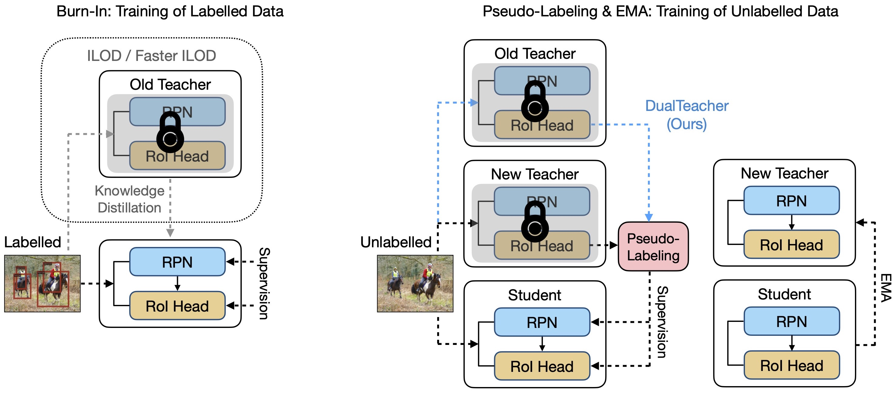

# Bridging Coexistence of Unlabelled Classes for Semi-supervised Incremental Object Detection


This is offical implementation of our paper:

> Bridging Coexistence of Unlabelled Classes for Semi-supervised Incremental Object Detection



## Installation

### Prerequisites

- Linux
- Conda
- 4 Tesla V100 32GB GPUs


### Install the CUDA and cuDNN libraries

```bash
conda create -n detectron2 python=3.8
conda activate detectron2
conda search cudatoolkit
conda search cudnn
# Please check here for a version that is compatible with your hardware environment; otherwise, subsequent installations may not be possible.
conda install cudatoolkit==9.2
conda install cudnn==7.6.5
```


### Install Pytorch

```bash
conda install pytorch==1.7.0 torchvision==0.8.0 cudatoolkit=9.2 -c pytorch
```


### Install Detectron2

```bash
python -m pip install detectron2==0.5 -f \
https://dl.fbaipublicfiles.com/detectron2/wheels/cu92/torch1.7/index.html
```


## Dataset Preparation

```bash
# download coco2017 dataset
wget http://images.cocodataset.org/zips/train2017.zip
wget http://images.cocodataset.org/zips/val2017.zip
wget http://images.cocodataset.org/annotations/annotations_trainval2017.zip
```


Please unzip the file and place the data in the format described below:

```bash
dual_teacher/
└── datasets/
    └── coco/
        ├── train2017/
        ├── val2017/
        └── annotations/
        	├── instances_train2017.json
        	└── instances_val2017.json

```


## Training

- Train a first(base) phase model

```bash
# use normal semi-supervised trainer
cp ubteacher/engine/original_trainer.py ubteacher/engine/trainer.py
```

Set` /ubteacher/data/build.py` `used_class_nums` as your choice(e.g. (0,16) in 5-phase setting)

Set `configs/coco_supervision/mod_sup5.yaml` `MAX_ITER`and `STEPS` (The size depends on the category range you choose.)

```bash
# run
python train_net.py \
      --num-gpus 4 \
      --config configs/coco_supervision/mod_sup5.yaml \
       SOLVER.IMG_PER_BATCH_LABEL 16 SOLVER.IMG_PER_BATCH_UNLABEL 16
```


- Train the new phase

At this point, you should have a trained checkpoint file. We assume its path to be `output/model_newclass_phase_0.pth`

```bash
# use our dual-teacher trainer
cp ubteacher/engine/dual_teacher_trainer.py ubteacher/engine/trainer.py
```

Please modify `old_teacher_paras` in `trainer.py` to your checkpoint absolute path.

Also modify `/ubteacher/data/build.py` and `configs/coco_supervision/mod_sup5.yaml` like the previous section.

```bash
# Resume
python train_net.py \
      --resume \
      --num-gpus 4 \
      --config configs/coco_supervision/mod_sup5.yaml \
       SOLVER.IMG_PER_BATCH_LABEL 16 SOLVER.IMG_PER_BATCH_UNLABEL 16 MODEL.WEIGHTS ./output/model_newclass_phase_0.pth
```


## Evaluation

```bash
# Evaluation
python train_net.py \
      --eval-only \
      --num-gpus 4 \
      --config configs/coco_supervision/mod_sup5.yaml \
       SOLVER.IMG_PER_BATCH_LABEL 16 SOLVER.IMG_PER_BATCH_UNLABEL 16 MODEL.WEIGHTS ./output/model_newclass_phase_0.pth
```

## Citation

```bibtex
@article{yuan2023dualteacher,
  title={DualTeacher: Bridging Coexistence of Unlabelled Classes for Semi-supervised Incremental Object Detection},
  author={Yuan, Ziqi and Wang, Liyuan and Ding, Wenbo and Zhang, Xingxing and Zhong, Jiachen and Ai, Jianyong and Li, Jianmin and Zhu, Jun},
  journal={arXiv preprint arXiv:2401.05362},
  year={2023}
}
```
